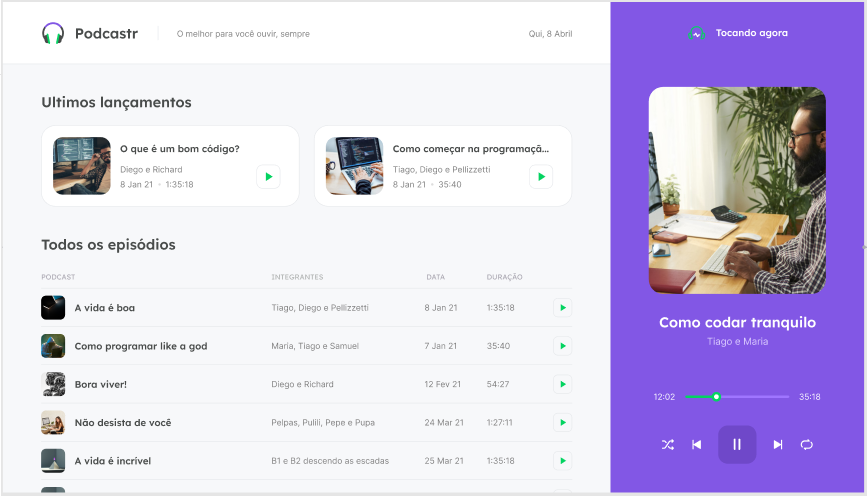

# Podcastr

<p>
  
  
  
  <a href="https://github.com/paulofl/podcastr/commits/master">
    
  </a>
</p>


## Tópicos 

[Sobre](#sobre)

[Tecnologias](#tecnologias)

[Instalação e uso](#instalação-e-uso)

<br>

## Sobre o Podcastr

O Podcastr é uma aplicação desenvolvida durante a Next Level Week 5 de React da RocketSeat. Nele podemos escutar nossos podcasts preferidos e acompanhar a postagem de novos. O projeto foi construído ao longo de 5 dias com tecnologias e conceitos mais recentes do desenvolvimento web, usando NextJS e React e fazendo o fetch de uma API fake para trazer novos dados diariamente.

<br>

<p>
  <a href="https://www.figma.com/file/UwFEntsHpHYJlHNQAQr4gA/Podcastr/duplicate">
    
  </a>
</p>

<br>

<p align="center">
  
</p>

## Tecnologias

Tecnologias e ferramentas utilizadas no desenvolvimento do projeto:

- [React](https://reactjs.org/)
- [Next.js](https://nextjs.org/)
- [TypeScript](https://www.typescriptlang.org/)
- [Styled Components](https://styled-components.com/)

<br>

## Instalação e uso

```bash
# Abra um terminal e copie este repositório com o comando
$ git clone https://github.com/paulofl/podcastr.git
# ou use a opção de download.

# Entre na pasta web com 
$ cd podcastr

# Instale as dependências
$ yarn install

# Rode o aplicação
$ yarn start
```

<br>

---

Feito com :heart: by [Paulo Fernando](https://github.com/paulofl)

[](https://www.linkedin.com/in/paulocornelio/) 
[](mailto:paulofernandocornelio@gmail.com)
